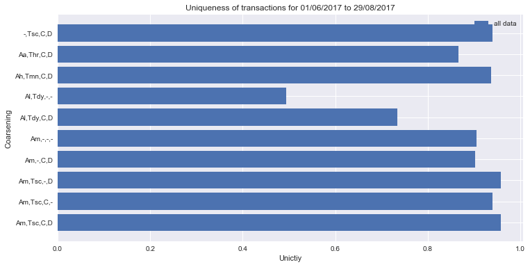

# Ripple-and-privacy

# Summary
For a summary of unicity results for 01/06/2017 to 29/08/2017, see (here)[Ripple unicity summary.ipynb]

Uniqueness calculations for 01/06/2017 to 29/08/2017 (to be compared with [1]):

# TODO / Suggestions
1. Understand cause of discrepancies. Verify the results are true
2. Calculate unicity using 2,3,4,5 points

[1] Luzio, A. D., Mei, A., & Stefa, J. (2017). Consensus Robustness and Transaction De-Anonymization in the Ripple Currency Exchange System. In 2017 IEEE 37th International Conference on Distributed Computing Systems (ICDCS) (pp. 140–150). [https://doi.org/10.1109/ICDCS.2017.52](https://doi.org/10.1109/ICDCS.2017.52)
